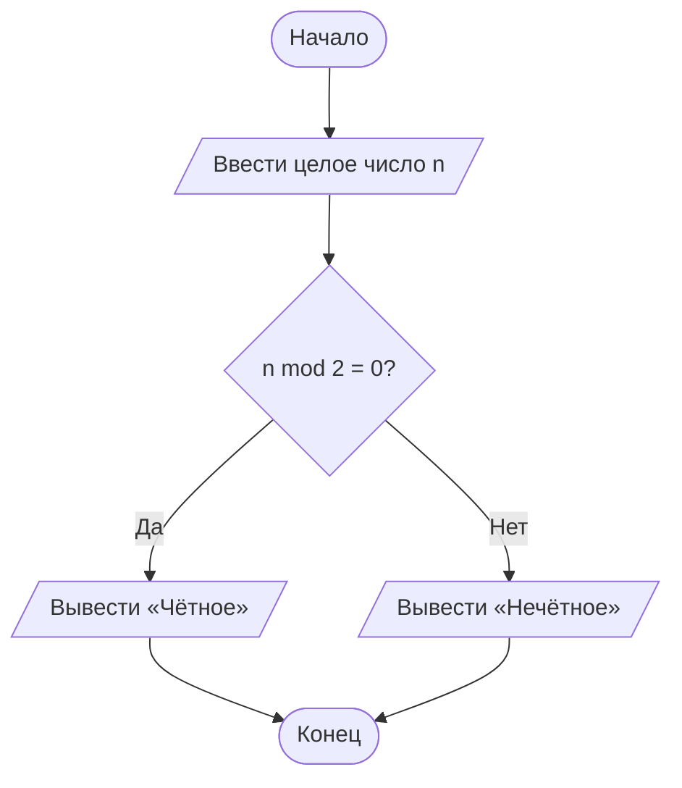

# Проверка чётности числа

Гайфуллин Р. И., ИВТ-ИСУ-104б

```mermaid
flowchart TD
    A([Начало]) --> B[/Ввести целое число n/]
    B --> C{n mod 2 = 0?}
    C -->|Да| D[/Вывести «Чётное»/]
    C -->|Нет| E[/Вывести «Нечётное»/]
    D --> F([Конец])
    E --> F
```

Ноль считается чётным: остаток от деления 0 на 2 равен 0.
